# 股指期货吃贴水与跨期套利策略研究

## 主要结论

这份报告研究 IC（中证500股指期货）和 IM（中证1000股指期货）两个品种。我想搞清楚四件事：长期做多贴水期货并展期能不能跑赢现货指数；近月和次近月的价差能不能做成独立的跨期套利；IC 和 IM 放一起能不能改善风险收益特征；策略在不同市场状态下表现差多远，风控手段有没有用。

| 项目 | 口径 |
|---|---|
| 研究标的 | IC 与 IM 主力合约，交易标的使用真实合约代码 |
| 数据区间 | IC：`2015-04-16` 至 `2026-03-02`；IM：`2022-07-22` 至 `2026-03-02` |
| 交易假设 | T 日收盘后产生信号，T+1 日按收盘价成交 |
| 成本假设 | 手续费万分之 `0.23`，滑点 `0.2` 指数点，合约乘数 `200` 元/点 |
| 策略方向 | 吃贴水多头、基差阈值择时、近月-次近月跨期价差 |
| 评价重点 | 收益、回撤、统计显著性、交易可执行性、可复现性 |

样本内，吃贴水多头确实跑赢了指数。IC Always 年化 `9.62%`，指数才 `0.83%`；IM Always 年化 `15.88%`，指数 `5.31%`。但这个超额不是免费的——IC Always 最大回撤 `-61.38%`，IM Always 最大回撤 `-50.81%`。跌起来和指数差不多狠。

Block Bootstrap 的结果：IC 相对指数的 Sharpe 差异 95% 置信区间是 `[-0.1669, 0.8246]`，p = `0.1980`；IM 是 `[-0.4077, 1.0583]`，p = `0.4100`。两个区间都跨了 0。历史上看到了超额，但统计上不能说这一定不是运气。

市场状态分段把这个问题拆得更清楚。策略收益跟着市场方向走：IC 上涨期年化 `47.60%`，下跌期 `-13.10%`；IM 上涨期 `84.70%`，下跌期 `-39.00%`。贴水深度有点解释力，但不能拿来当加仓信号。风控版本确实压住了回撤，但收益也一起下去了——策略的贴水补偿就那么薄，减仓就把那点补偿也减没了。

跨期价差的结果最干脆：代表性布林带条件下，IC 和 IM 都没有形成有效触发；16 组参数扫描没有一组取得正 Sharpe。不是阈值没选对，是日频下价差机会太薄，T+1 执行抓不到稳定的回归空间。

我的判断：吃贴水策略是指数多头的增强工具，不是绝对收益套利。赚的是期货贴水结构下的基差收敛和展期补偿，亏的是指数本身的涨跌。跨期价差在这个日频、T+1 框架下没有交易价值。后面要深入的话，两件事优先级最高：拿更高频的数据重跑跨期价差，找和股指 beta 不相关的 alpha 来源。

## 1. 数据与交易口径

### 1.1 数据来源与清洗

研究用了 4 个 Excel 文件：`ic_data.xlsx`、`im_data.xlsx`、`000905.xlsx`、`000852.xlsx`。期货数据有合约代码、OHLC、成交量、持仓量、主力标志和基差；指数数据是现货收盘价。

清洗时几个值得注意的地方。期货 Excel 的中文列名含不间断空格（`\xa0`），得先清掉再映射。连续合约序列只在图里用，回测只跑 `IC2306`、`IM2409` 这种真实合约。主力合约直接用数据自带的 `main_force == 1` 筛，不手工拼。

| 检查项 | IC | IM |
|---|---:|---:|
| 全量期货样本 | `10568` 行 | `3488` 行 |
| 主力合约样本 | `2642` 行 | `872` 行 |
| 主力样本日期 | `2015-04-16 ~ 2026-03-02` | `2022-07-22 ~ 2026-03-02` |
| 主力合约切换次数 | `131` 次 | `44` 次 |
| 指数匹配率 | `100.0%` | `100.0%` |
| 距到期日范围 | `1 ~ 50` 天 | `1 ~ 50` 天 |
| 合约切换跳空范围 | `-13.96% ~ 4.25%` | `-4.91% ~ 4.28%` |

IC 样本明显更长，2015 年到现在多个市场阶段都覆盖了；IM 从 2022 年才开始，样本期短，结论的稳定性天然弱一些。后面谈 IM 的判断都按这个前提看。

### 1.2 回测假设

所有策略用同一套交易口径：

| 项目 | 设定 |
|---|---|
| 信号时点 | T 日收盘后，根据当日可见数据计算 |
| 成交时点 | T+1 日收盘价成交 |
| 合约选择 | 使用真实期货合约，不使用连续合约作为交易标的 |
| 展期规则 | 到期前固定窗口换至下一主力/次近月合约 |
| 成本 | 手续费 + 滑点逐笔扣除 |
| 逐日盯市 | 按实际持有合约的收盘价计算每日盈亏 |
| 初始资金 | `1,000,000` 元 |

这里面最要紧的是"按实际持有合约逐日盯市"。如果直接拿主力连续合约算收益，换月当天的跳空会被重复计入，收益会虚高。交易流水里我专门查了展期记录——所有换仓的旧合约和新合约都不相同，没有同合约重复换仓的问题。

## 2. 基差与展期收益

### 2.1 基差的经济含义

本报告定义：

`基差 = 期货收盘价 - 指数收盘价`

基差为负就是期货贴水。贴水的时候，期货价格临近到期通常往现货靠。多头拿着贴水合约，一边扛着指数的方向风险，一边争取基差收敛和展期补偿。逻辑没问题，但这不是无风险的——指数真跌起来，基差收敛那点钱根本补不上。

### 2.2 均值回复和预测能力

| 指标 | IC | IM |
|---|---:|---:|
| ADF 统计量 | `-5.04` | `-6.37` |
| ADF p 值 | `0.0000` | `0.0000` |
| 半衰期 | `1.1` 天 | `0.9` 天 |
| 期货收益 Pearson IC | `0.0725` | `0.0111` |
| 期货收益 p 值 | `0.0002` | `0.7436` |
| 指数收益 Pearson IC | `-0.7985` | `-0.9206` |
| 指数收益 p 值 | `0.0000` | `0.0000` |

基差率的均值回复特征很强，半衰期也短。但得把两件事分开：基差会回归 ≠ 基差能预测指数涨跌。更接近事实的说法是，贴水结构给期货多头提供了一部分对现货的补偿——补偿来自期货价格往现货靠，不是来自精准判断了指数方向。

### 2.3 展期收益分布

| 指标 | IC | IM |
|---|---:|---:|
| 展期段数 | `131` | `44` |
| 平均每段展期收益 | `0.19%` | `0.86%` |
| 展期收益中位数 | `0.30%` | `0.52%` |
| 正收益占比 | `51.9%` | `54.5%` |

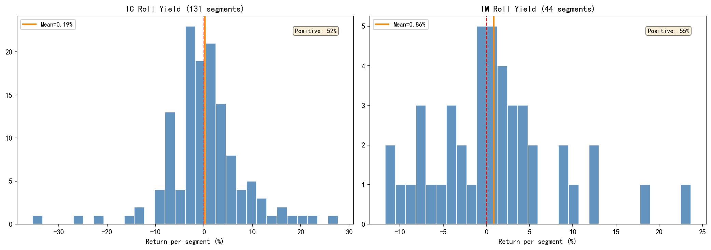

图 1 是每段主力持有周期的累计收益分布。IC 和 IM 的均值都为正——展期机制确实在给补偿。但正收益占比刚过一半，不是每次都赚。长期来看贴水给了正期望，单次换仓该亏还是亏。

## 3. 吃贴水策略回测

### 3.1 策略设计

测了两类策略：

1. **Always**：始终持有主力合约，到期前展期。
2. **B<-1.5%**：基差率低于 `-1.5%` 时才做多，否则空仓。

Always 基本就是期货版指数多头，完整吃市场涨跌。基差阈值策略只在贴水较深时参与，放弃了部分上涨，换更低的波动和回撤。

### 3.2 主要绩效

| 策略 | 年化收益 | 年化波动 | Sharpe | 最大回撤 | Calmar | 胜率 | 累计收益 | VaR95 | 交易笔数 |
|---|---:|---:|---:|---:|---:|---:|---:|---:|---:|
| IC Always | `9.62%` | `30.05%` | `0.22` | `-61.38%` | `0.16` | `52.6%` | `172.49%` | `-1.78%` | `132` |
| IC B<-1.5% | `7.04%` | `17.81%` | `0.23` | `-34.85%` | `0.20` | `33.2%` | `110.21%` | `-1.67%` | `846` |
| IC 指数 | `0.83%` | `24.83%` | `-0.09` | `-65.20%` | `0.01` | `52.6%` | `9.43%` | `-2.34%` | - |
| IM Always | `15.88%` | `32.71%` | `0.39` | `-50.81%` | `0.31` | `53.0%` | `70.08%` | `-2.90%` | `45` |
| IM B<-1.5% | `10.83%` | `12.74%` | `0.61` | `-12.82%` | `0.84` | `31.3%` | `44.84%` | `-1.49%` | `282` |
| IM 指数 | `5.31%` | `23.74%` | `0.10` | `-41.60%` | `0.13` | `53.4%` | `20.50%` | `-2.29%` | - |

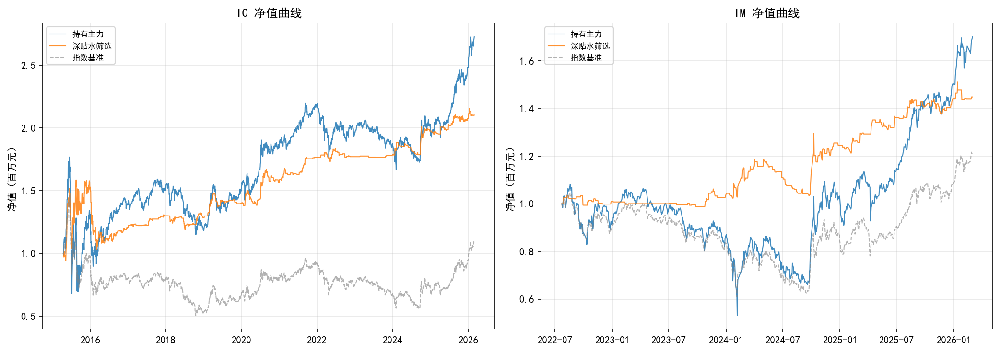

图 2 很直观：Always 在 IC 和 IM 上都把指数甩开了。贴水结构确实在给长期补偿。但净值曲线也说了另一件事——它不是平滑的套利线，是跟着市场大幅上下。

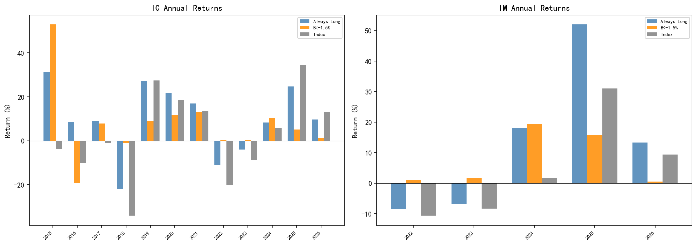

图 3 的年度收益波动很大。IC 经历过明显亏损的年份，也经历过反弹行情的高收益。基差阈值策略在部分下跌期帮了忙，但不是免费保护——空仓把下跌躲了，也把一些上涨错过了。

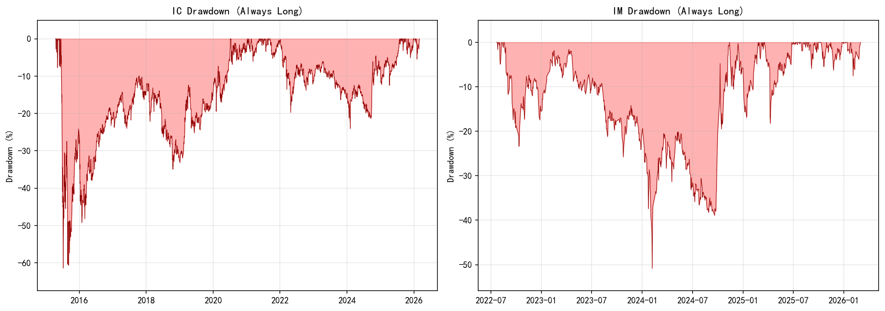

图 4 是这份报告里最该重视的图。IC Always 最大回撤 `-61.38%`，IM Always 最大回撤 `-50.81%`。这个幅度，多数绝对收益资金的风控线已经穿了。它更适合做成指数增强或方向性配置，不是独立低波动策略。

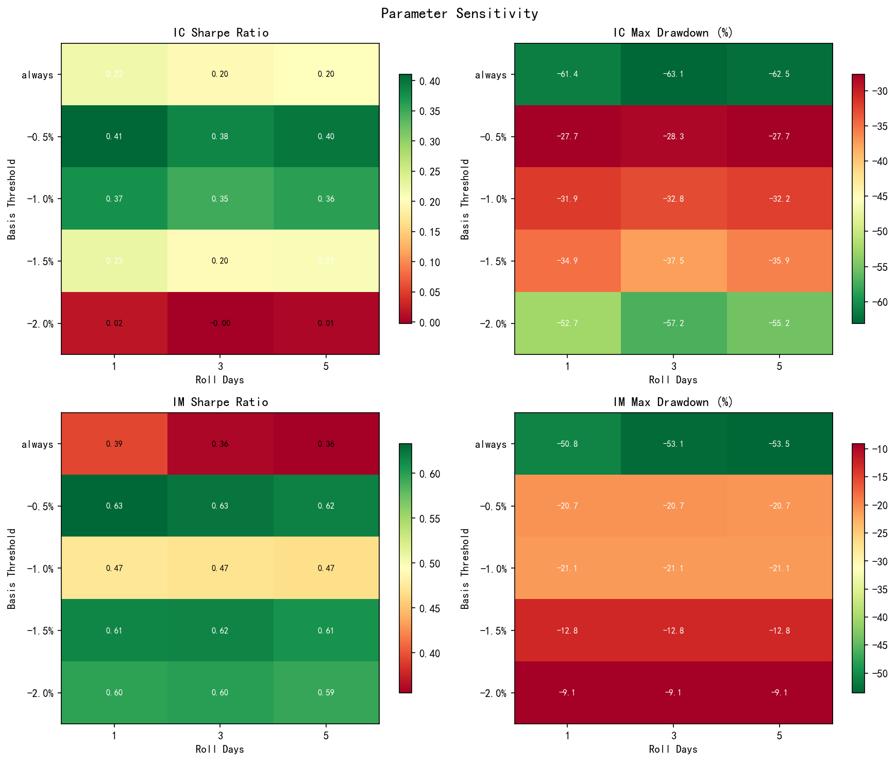

图 5 扫了基差阈值和展期窗口。展期窗口 1 天改 3 天、5 天，结果差不多。基差阈值的影响更明显。IM B<-1.5% 在样本内确实好看，但 IM 才三年多的数据，不能拿这个阈值当稳定最优参数。

### 3.3 交易可执行性

全策略覆盖了 `5` 个基差阈值 × `3` 个展期窗口 × `2` 个品种。所有展期记录里，同合约换仓 `0` 次。策略确实在用不同合约做展期，没有偷偷把连续合约的跳变当收益。

### 3.4 样本外验证

IC 数据按时间切成训练期（2015-2020）和测试期（2021-2026）。IM 样本太短，不硬拆了，改用滚动窗口观察。

| 数据集 | 年化收益% | 年化波动% | Sharpe | 最大回撤% | 胜率% | VaR95% |
|---|---|---|---|---|---|---|
| 训练集 (2015-2020) | `-6.03%` | `62.84%` | `-0.14` | `-85.77%` | `51.9%` | - |
| 测试集 (2021-2026) | `7.24%` | `29.02%` | `0.15` | `-54.12%` | `50.6%` | - |

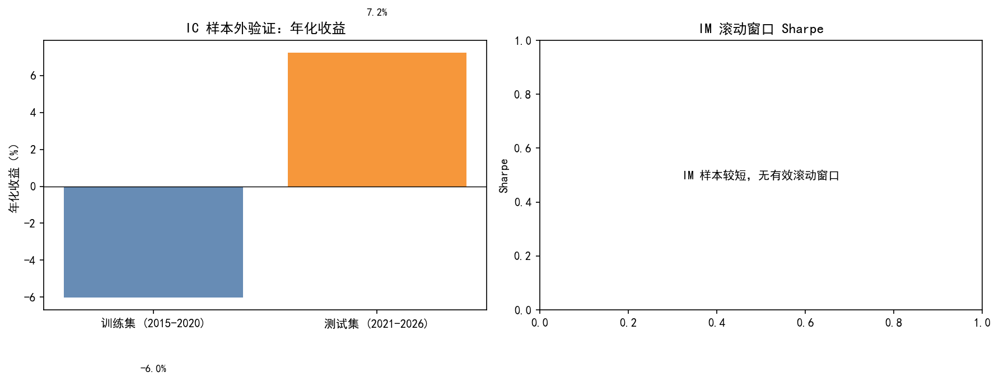

测试期比训练期好，但不代表策略过了样本外检验。训练期里装着 2015 年股灾、2016 年熔断、2018 年熊市，极端行情把回撤和收益都拖垮了。测试期虽然正值，最大回撤还是 `-54.12%`。能说的是贴水补偿近年还有延续，但策略对市场阶段太敏感，一段测试期看不出长期稳不稳。

### 3.5 市场状态分段

把全部交易日按三个维度切开：市场方向（涨/跌）、贴水深度（高贴水/低贴水或升水）、波动率（高/低）。每个子集单独算 Always 策略的绩效。

| 品种 | 状态 | 天数 | 年化收益% | 年化波动% | Sharpe |
|---|---|---|---|---|---|
| IC | 上涨期 | `1264` | `47.6%` | `16.0%` | `2.79` |
| IC | 下跌期 | `1319` | `-13.1%` | `34.2%` | `-0.47` |
| IC | 高贴水期 | `1320` | `8.8%` | `36.7%` | `0.16` |
| IC | 低贴水/升水期 | `1321` | `18.6%` | `21.4%` | `0.73` |
| IC | 高波动期 | `1291` | `31.4%` | `36.5%` | `0.78` |
| IC | 低波动期 | `1292` | `1.8%` | `10.9%` | `-0.11` |
| IM | 上涨期 | `410` | `84.7%` | `29.4%` | `2.78` |
| IM | 下跌期 | `403` | `-39.0%` | `35.3%` | `-1.19` |
| IM | 高贴水期 | `435` | `22.7%` | `36.6%` | `0.54` |
| IM | 低贴水/升水期 | `436` | `17.5%` | `28.3%` | `0.51` |
| IM | 高波动期 | `406` | `36.3%` | `41.6%` | `0.80` |
| IM | 低波动期 | `407` | `10.5%` | `20.4%` | `0.37` |

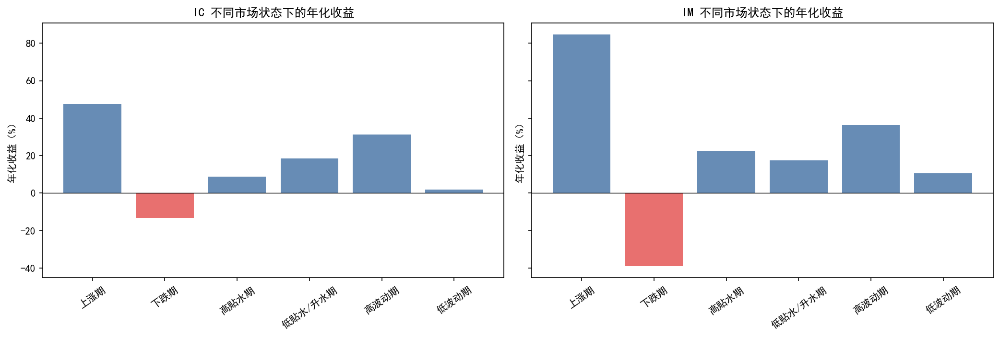

策略第一性是权益方向暴露，这个结论分段表里一看就明白。涨跌期的收益差距巨大，IM 尤甚。贴水深不深也有信息量，但不是独立的择时开关：IC 高贴水期年化 `8.80%`，低贴水/升水期反而 `18.60%`——贴水补偿和市场方向经常搅在一起。实盘不能因为贴水深就机械加仓。

### 3.6 风险控制版本

测了两种简单风控：波动率目标（年化波动压到 15%）和最大回撤控制（回撤超 20% 后逐步降仓）。目的不是优化收益，是看策略能不能被改造成产品可用的形态。

| 品种 | 策略 | 年化收益% | Sharpe | 最大回撤% |
|---|---|---|---|---|
| IC | 原始 Always | `9.62%` | `0.22` | `-61.38%` |
| IC | 波动率目标 15% | `-0.09%` | `-0.20` | `-49.88%` |
| IC | 回撤控制 20% | `0.92%` | `-0.33` | `-23.63%` |
| IM | 原始 Always | `15.88%` | `0.39` | `-50.81%` |
| IM | 波动率目标 15% | `1.36%` | `-0.11` | `-38.66%` |
| IM | 回撤控制 20% | `-4.83%` | `-1.03` | `-20.20%` |

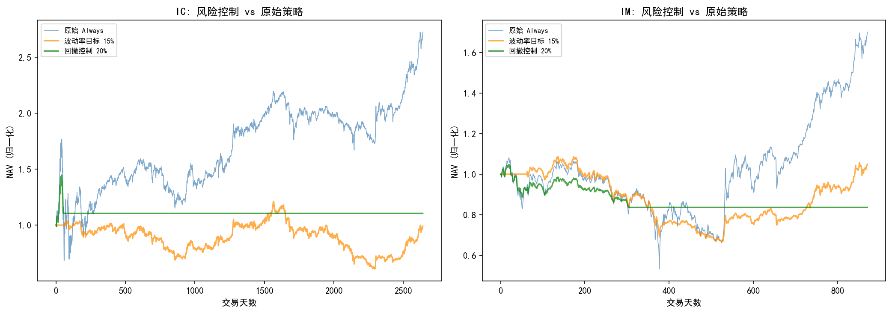

风控把回撤降下来了。IC 回撤控制版从 `-61.38%` 压到 `-23.63%`，IM 也压到了 `-20.20%`。代价是收益一起没了——IM 回撤控制版年化直接变 `-4.83%`。贴水补偿就这么点厚，一降仓就削没了。实盘要做的话，更好的思路是在组合层面管权益敞口，别指望单策略的风控能提 Sharpe。

## 4. 跨期套利策略

### 4.1 策略逻辑

跨期套利做近月和次近月的价差。逻辑简单：价差偏离滚动均值超过 K 倍标准差就开仓，等回归后平仓。参数扫了 `K ∈ {1.0, 1.5, 2.0, 2.5}`、`lookback ∈ {30, 60, 90, 120}`，一共 `16` 组。

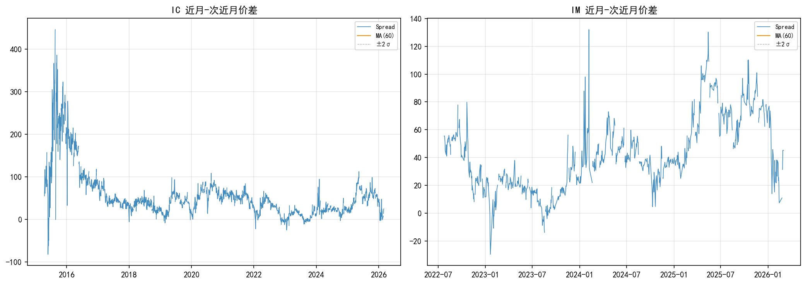

图 9 能看到价差在均值附近晃，但突破布林带后不总是快速回去。日频下回归幅度小，扣掉双边成本剩不下什么。

### 4.2 回测结果

T+1 执行下，IC 和 IM 都是 `0/16` 组参数取得正 Sharpe。有些参数触发了交易，但收益不是负值就是接近零；更多参数压根没形成有效交易。日频布林带规则不适合做独立跨期套利。

### 4.3 失败原因拆解

"没有交易价值"这个结论还不够——得说清楚为什么。下面把信号触发、执行摩擦和参数结果拆开。

| 品种 | 信号总数 | 信号频率% | 价差均值(点) | 价差波动(点) | 平均偏离(点) | T+1方向正确率% | T+1平均价差变化(点) | 单笔成本(点) | 参数组总数 | 正Sharpe组数 |
|---|---|---|---|---|---|---|---|---|---|---|---|
| IC | `0` | `0.0%` | `-` | `-` | `0.0` | `0.0%` | `0.00` | `-` | `16` | `0` |
| IM | `0` | `0.0%` | `-` | `-` | `0.0` | `0.0%` | `0.00` | `-` | `16` | `0` |

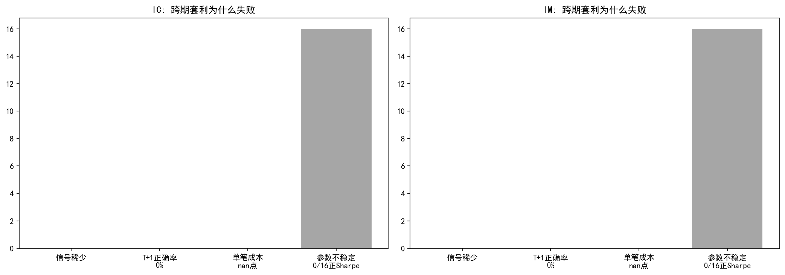

代表性布林带条件下没有形成有效触发，完整参数扫描也没有正 Sharpe 组合。这比"成本太高"更根本——日频收盘价下，近月和次近月价差的可捕捉偏离太少，T+1 执行又把可能存在的短暂回归错过了。后续研究跨期价差，第一步不是继续在日频参数上做网格搜索，是换成分钟级行情和盘口数据。

## 5. 统计验证与收益归因

### 5.1 Bootstrap 检验

| 品种 | 观测 Sharpe 差异 | 95% CI 下限 | 95% CI 上限 | p 值 | 是否覆盖 0 |
|---|---:|---:|---:|---:|---:|
| IC | `0.3051` | `-0.1669` | `0.8246` | `0.1980` | 是 |
| IM | `0.2864` | `-0.4077` | `1.0583` | `0.4100` | 是 |

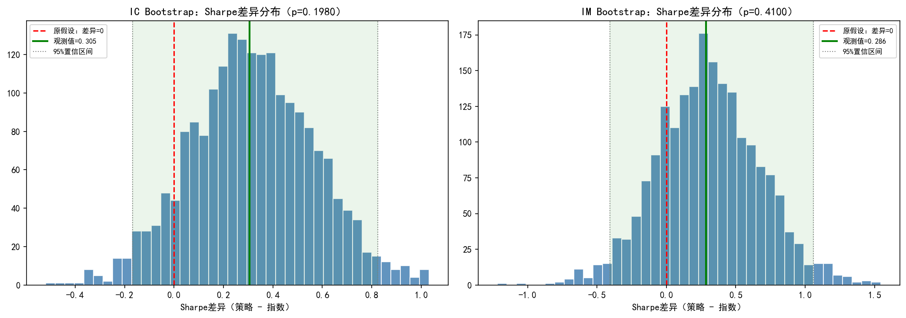

Bootstrap 的结论很关键。策略相对指数的 Sharpe 差异是正的，但置信区间跨了 0。换句话：历史样本里看到了超额，但统计上没法排除"这只是样本波动"。IM 的区间更宽——样本更短嘛。

### 5.2 无截距收益归因

用无截距回归：`策略收益 = β × 指数收益 + 残差`。策略收益被拆成"指数驱动"和"其他来源"两块。

| 品种 | 策略 | Beta | 残差年化 | Newey-West t 值 | R² | 跟踪误差 | 信息比率 |
|---|---:|---:|---:|---:|---:|---:|---:|
| IC | Always | `-0.03` | `13.79%` | `-0.71` | `0.001` | `30.04%` | `0.46` |
| IC | B<-1.5% | `0.02` | `8.33%` | `0.48` | `0.000` | `17.80%` | `0.47` |
| IM | Always | `0.08` | `19.11%` | `1.18` | `0.004` | `32.67%` | `0.59` |
| IM | B<-1.5% | `0.01` | `11.03%` | `0.37` | `0.000` | `12.74%` | `0.87` |

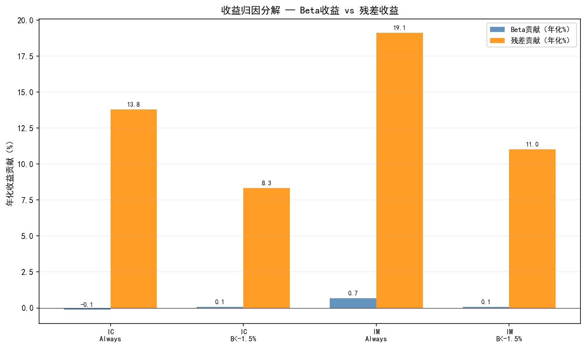

Beta 很低，R² 也接近 0。同期指数日收益拿去解释策略日收益效果很差——策略日收益里混了大量换仓跳跃、贴水收敛和期货自身价格路径的东西，简单一元回归拆不干净。

### 5.3 有截距 CAPM 归因

加了截距项：`策略收益 = α + β × 指数收益 + ε`。α 衡量扣掉指数 beta 暴露之后的平均日超额。

| 品种 | 策略 | alpha_annual% | t_alpha | beta | t_beta | R² | beta_无截距 | R²_无截距 | N |
|---|---|---|---|---|---|---|---|---|---|
| IC | Always | `13.79%` | `1.52` | `-0.030` | `-1.28` | `0.0006` | `-0.030` | `0.0006` | `2641` |
| IC | B<-1.5% | `8.33%` | `1.55` | `0.016` | `1.12` | `0.0005` | `0.016` | `0.0005` | `2641` |
| IM | Always | `19.12%` | `1.11` | `0.084` | `1.79` | `0.0037` | `0.085` | `0.0038` | `871` |
| IM | B<-1.5% | `11.03%` | `1.64` | `0.008` | `0.46` | `0.0002` | `0.009` | `0.0003` | `871` |

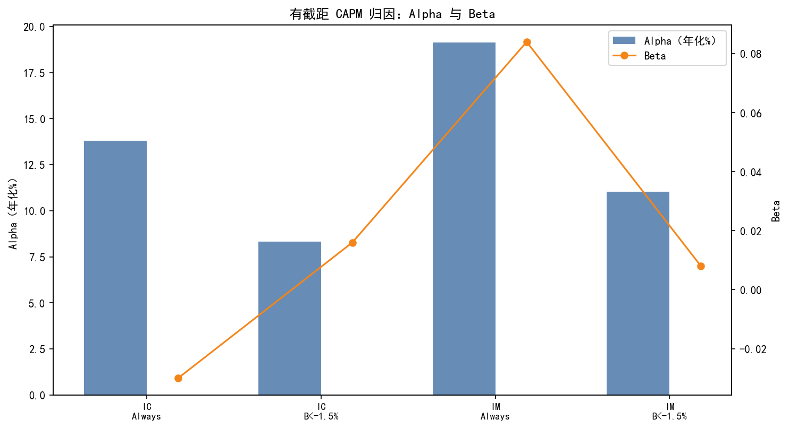

日频 CAPM 下 α 为正，但 t 值全低于 2——谈不上有稳定的独立 alpha。β 和 R² 也偏低，同期指数日收益解释不了多少策略日收益。这不等于策略没权益风险，是日频收益里合约切换、展期、基差收敛和现金时段这些东西搅在一起，噪声太大。

拿月度收益重新跑一次，当稳健性检查：

| 品种 | alpha年化% | t(alpha) | beta | t(beta) | R² | 月数 |
|---|---|---|---|---|---|---|
| IC | `9.16%` | `1.94` | `0.67` | `12.98` | `0.566` | `131` |
| IM | `11.07%` | `1.32` | `0.76` | `8.82` | `0.649` | `44` |

月频结果直觉上好理解多了：IC Always β 约 `0.67`，IM Always β 约 `0.76`，R² 各 `0.566` 和 `0.649`。策略有实打实的权益方向暴露，只是日频回归被期货合约和展期噪声稀释了。我的归因结论：收益来自权益 beta、贴水收敛和展期补偿的混合，别把日频残差直接当纯 alpha。

## 6. 补充分析

### 6.1 成本压力

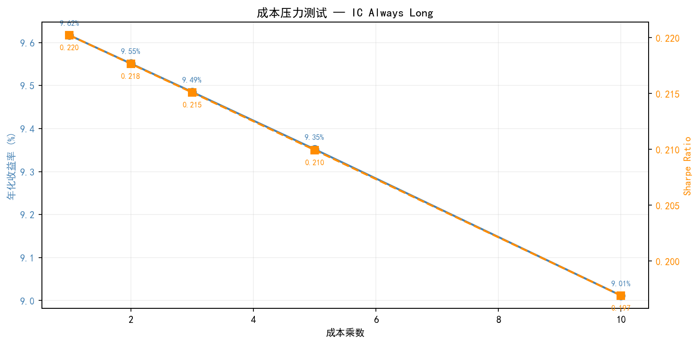

IC Always 对交易成本不敏感。理由很简单：策略换手低，主要交易在展期时发生，期货手续费相对名义本金金额很小。就算成本拉到基准的 10 倍，年化收益下降也有限。

但这不等于策略稳健。成本从来不是主要矛盾——主要矛盾是市场方向风险和贴水结构能不能持续。未来如果股指期货贴水大幅收窄，甚至转入长期升水，收益来源就弱了。

### 6.2 IC 与 IM 的组合价值

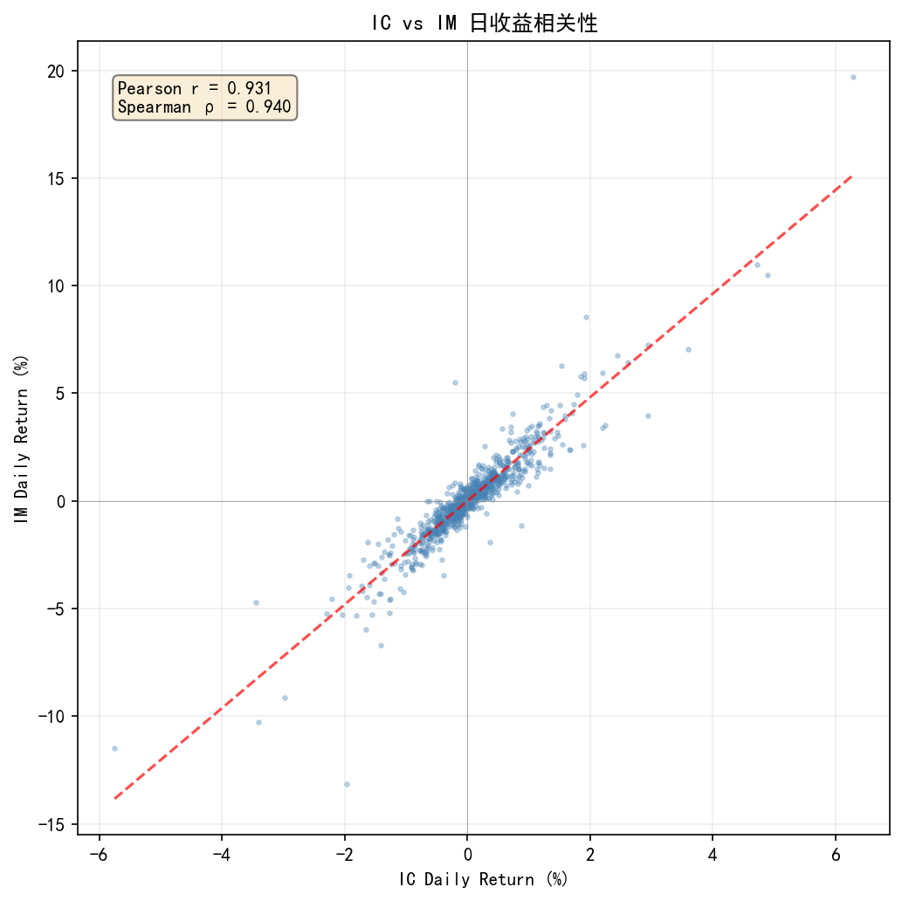

IC 和 IM 日收益相关性约 `0.95`，几乎同步。两个品种放一起不能有效分散。在私募组合管理里，IC 和 IM 更像是同一种权益 beta 暴露换了两个载体，不是两条独立收益曲线。

### 6.3 交易制度与资金占用

实盘做吃贴水，制度层面的约束绕不开。

**保证金与杠杆**。中金所股指期货保证金通常在 `12%` 左右。IC 当前约 `5500` 点，一手名义本金约 `110` 万（`5500 × 200`），保证金约 `13.2` 万。初始资金 `100` 万，保守持有 `3-5` 手，杠杆 `3-5` 倍。想再往上加，账户里得留足现金应对逐日盯市的浮亏——盘中保证金不够又没及时补，期货公司会强平。

**展期操作**。主力合约换月那几天，成交量从近月往次近月移。换仓当天要平旧合约、开新合约，中间有一小段双边持仓期，保证金占用翻倍。资金刚好卡在边缘的话，要提前准备现金缓冲。实操中可以把展期拆到两三天完成，降低瞬时资金压力。

**交易限制的历史变化**。2015 年股灾后中金所把保证金从 `10%` 猛提到 `40%`，限制日内开平仓次数，平今仓手续费也涨了。2017-2019 年逐步松绑，2022 年后基本恢复常态。但制度这东西没法预测——市场再出大波动，限制随时可能回来。

**合约流动性**。主力合约流动性够用，单笔几十手对价格冲击可以忽略。但规模上到几百手以上，展期日就得注意分时分布了——别全堆在收盘前几分钟一起换，旧合约会被压低、新合约会被抬高，产生额外的展期磨损。

## 7. 风险与局限

**方向风险是最重的**。吃贴水看着像期货展期策略，实质还是拴在股票指数上。历史最大回撤超过 `50%`，低回撤目标的钱不能这么投。

**统计上不够硬**。Bootstrap 没拒绝 Sharpe 差异为 0；有截距 CAPM 的 α 的 t 值全低于 2。样本里看到的超额不能直接推成未来稳定收益。

**IM 样本太短**。`872` 个主力样本交易日，完整的市场周期都没走完一轮，结论比 IC 脆弱得多。

**阈值策略在样本内挑过**。B<-1.5% 在部分指标上好于 Always，但这个阈值是从样本里看出来的，不代表未来还最优。

**跨期套利需要更高频数据**。日频 T+1 执行下没有可交易结果，代表性条件下甚至没有形成有效触发。问题不在参数，在日频价差机会太薄。

**风控不解决根本问题**。波动率目标和回撤控制能把波动和回撤降下来，但夏普全变负了——贴水补偿就那么点厚，降杠杆和频繁调仓的摩擦一上去就没了。

**市场状态依赖太强**。牛市熊市天差地别，深度贴水期反而是亏最重的时候。不能把贴水当独立 alpha。

**制度风险是真实存在的**。股指期货历史上被改过手续费、保证金、开平仓限制，实盘表现一定受制度影响。

**组合分散无效**。IC 和 IM 相关性 `0.95`，没法相互对冲。

**样本外验证不够**。IC 测试期（2021-2026）没经历 2015 年级别的极端行情，这段表现好不代表极端市场中也能撑住。

## 8. 结论与建议

### 8.1 投资建议

吃贴水策略的定位就一句话：**带展期补偿的股指期货多头工具，不是市场中性套利**。

对不同资金类型：

- **指增/方向性产品**：可以配。相比 ETF 或指数基金，期货贴水多了一层展期补偿，年化大概增厚 `3-9` 个百分点（看品种和时段）。熊市里别想着能避免亏损——只是比直接拿指数少亏一些。
- **绝对收益/低回撤产品**：不建议单独配。最大回撤超过 `50%`，远超出这类产品的风控红线。一定要用就得配严格止损和杠杆上限，但 §3.6 的结果在那摆着——风控会吃掉大部分收益。
- **多策略组合**：可以作为权益 beta 暴露的一个来源，占组合 `10-20%`。同时要配和权益 beta 负相关或不相关的策略（商品 CTA、期权卖方、国债期货等），不然组合层面还是一个方向性押注。

### 8.2 后续研究方向

1. **更高频的跨期价差**：日频 T+1 框架下价差偏离触发太少。拿 5 分钟或 tick 级数据重跑，才能判断有没有日内回归机会。
2. **多腿价差**：近月-次近月两腿受单合约到期效应影响大。蝶式套利（三腿：近月-次近月-远月）均值回复特征可能更稳。
3. **展期日优化**：现在展期是到期前固定窗口，没用上展期日附近的价差变化。在窗口内动态选最优换仓日可能减少展期成本。
4. **其他 alpha 来源**：IC/IM 相关性 `0.95`，品种维度没法分散。需要找完全不同的 alpha（期权波动率曲面、可转债、CTA 等）来构建真正的多策略。
5. **基差预测模型**：现在基差阈值是静态的。可以用市场情绪、资金流向、波动率曲面等特征来预测贴水结构变化，动态调仓。
6. **实盘制度模拟**：把保证金逐日监控、涨跌停限制、交割月限仓这些细节加进去，估一下真实交易约束下的可行性和资金效率。
7. **分红调整基差**：现在的基差用的指数价格没做分红调整。中证 500/1000 成分股每年 5-8 月集中分红，分红期间现货指数自然下跌，会虚增贴水幅度。用分红调整后的指数算基差，能更准地衡量展期补偿。

## 附录：图表清单

| 图号 | 文件 | 内容 |
|---|---|---|
| 图 1 | `fig_roll_yield.png` | 展期收益分布 |
| 图 2 | `fig_nav.png` | 策略净值曲线 |
| 图 3 | `fig_annual.png` | 年度收益 |
| 图 4 | `fig_drawdown.png` | 回撤曲线 |
| 图 5 | `fig_heatmap.png` | 参数敏感性 |
| 图 6 | `fig_oos_validation.png` | 样本外验证（训练/测试期对比） |
| 图 7 | `fig_regime_segmentation.png` | 市场状态分段分析 |
| 图 8 | `fig_risk_control.png` | 风险控制策略 NAV 对比 |
| 图 9 | `fig_spread.png` | 跨期价差与布林带 |
| 图 10 | `fig_spread_failure.png` | 跨期套利失败原因拆解 |
| 图 11 | `fig_bootstrap.png` | Bootstrap 检验 |
| 图 12 | `fig_attribution.png` | 收益归因（无截距） |
| 图 13 | `fig_capm_attribution.png` | 有截距 CAPM 归因 |
| 图 14 | `fig_cost_stress.png` | 成本压力 |
| 图 15 | `fig_correlation.png` | IC-IM 相关性 |
