# 股指期货吃贴水与跨期套利策略研究

## 摘要

本报告研究 IC（中证500股指期货）和 IM（中证1000股指期货）的吃贴水与跨期套利策略。核心发现：

- 吃贴水策略跑赢指数。IC Always 年化收益 9.62%（指数 0.83%），IM Always 15.88%（指数 5.31%），超额来自期货贴水结构下的基差收敛与展期补偿。
- 超额不等于低风险。IC Always 最大回撤 -61.38%，IM Always -50.81%，策略本质是指数多头替代而非市场中性套利。
- Block Bootstrap 检验：IC Sharpe 差异 95% CI [-0.1669, 0.8246]，p = 0.1980；IM CI [-0.4077, 1.0583]，p = 0.4100。置信区间覆盖 0，统计上不能拒绝"超额为 0"的原假设。
- 跨期套利（日频 T+1）不可行：IC 和 IM 各 16 组参数扫描，均无正 Sharpe。限制不在参数选择，在日频收盘价下价差可捕捉偏离太少。
- 组合策略的分散化价值有限：IC 与 IM 日收益相关性约 0.95，品种组合不能有效降低波动。
- 风险控制（波动率目标/回撤控制）可降回撤，但夏普全部转负——贴水补偿的厚度不足以支撑降杠杆后的交易摩擦。
- 本研究从原始数据出发，Notebook 可从头执行复现，所有参数和随机种子固定。

| 项目 | 口径 |
|---|---|
| 研究标的 | IC 与 IM 主力合约，交易标的使用真实合约代码 |
| 数据区间 | IC：2015-04-16 至 2026-03-02；IM：2022-07-22 至 2026-03-02 |
| 信号与执行 | T 日收盘后产生信号，T+1 日收盘价成交 |
| 成本假设 | 手续费 0.23‱，滑点 0.2 指数点，合约乘数 200 元/点 |
| 初始资金 | 1,000,000 元 |

## 1. 数据与回测设定

### 1.1 数据来源

原始数据为 4 个 Excel 文件：`ic_data.xlsx`、`im_data.xlsx`（期货）、`000905.xlsx`、`000852.xlsx`（指数）。期货数据含合约代码、OHLC、成交量、持仓量、主力标志及基差字段；指数数据为对应现货收盘价。

数据清洗涉及以下处理：

- 期货 Excel 中文列名含不间断空格（`\xa0`），需 `replace` + `strip` 后映射。
- 回测仅使用 `IC2306` 等真实合约代码，连续合约序列（含 "0Y" 的 contract）仅用于展示。
- 主力合约按数据自带的 `main_force == 1` 筛选，不手工拼接。

| 检查项 | IC | IM |
|---|---:|---:|
| 全量期货样本 | 10,568 行 | 3,488 行 |
| 主力合约样本 | 2,642 行 | 872 行 |
| 日期范围 | 2015-04-16 ~ 2026-03-02 | 2022-07-22 ~ 2026-03-02 |
| 合约切换次数 | 131 次 | 44 次 |
| 指数匹配率 | 100.0% | 100.0% |
| 距到期日范围 | 1 ~ 50 天 | 1 ~ 50 天 |
| 合约切换跳空范围 | -13.96% ~ 4.25% | -4.91% ~ 4.28% |

IC 样本覆盖 2015 年以来多个市场阶段（股灾、熔断、熊市、COVID）；IM 自 2022 年起始，样本较短，结论稳定性弱于 IC。后文对 IM 的判断均在此前提下理解。

本报告所有数据均来源于 data/ 目录下 4 个 Excel 文件，指标计算与策略回测在 Notebook 中完成。后续表格不再重复说明数据出处。

### 1.2 回测协议

| 项目 | 设定 |
|---|---|
| 信号时点 | T 日收盘后，基于当日可见数据 |
| 成交时点 | T+1 日收盘价 |
| 合约选择 | 真实期货合约，不使用连续合约作为交易标的 |
| 展期规则 | 到期前固定窗口换至下一主力/次近月合约 |
| 成本 | 手续费 + 滑点逐笔扣除 |
| 逐日盯市 | 按实际持有合约的收盘价计算每日盈亏 |

逐日盯市基于实际持有合约（held-contract MTM），而非主力连续序列。若直接使用连续序列计算收益，合约切换日的跳空会被重复计入，导致收益虚高。交易流水中所有换仓记录的旧合约均不同于新合约，同合约重复换仓次数为 0。

### 1.3 可复现性保证

本研究可以完整复现，依赖以下要素：

- 数据源：4 个 Excel 文件存放于 data/ 目录，格式未作任何修改，对照原始文件可重建全部分析。
- Notebook：`notebooks/股指期货套利策略研究.ipynb` 从 Excel 读取开始，无预处理步骤。`jupyter nbconvert --execute --inplace` 从头执行通过，所有数字均为运行输出，非手工填入。
- 随机种子：Bootstrap 和随机基准分析固定种子，同输入下结果逐位一致。
- 参数公开：回测设定（T+1、持仓合约 MTM）、全部策略参数（基差阈值、展期窗口、布林带 K 和 lookback）、成本假设（手续费 0.23‱、滑点 0.2 点、保证金率 12%）均在正文列出，无隐藏自由度。

## 2. 基差因子

### 2.1 定义与经济含义

本文定义基差为期货收盘价减去指数收盘价。基差为负表示期货贴水。

贴水市场中，期货价格临近到期向现货指数收敛。多头持有贴水合约，在承担指数方向风险的同时，获取基差收敛收益及展期补偿。基差会均值回复，但不等于基差能预测指数方向——指数下跌时，基差收敛的幅度通常无法覆盖方向亏损。

### 2.2 均值回复与预测能力

| 指标 | IC | IM |
|---|---:|---:|
| ADF 统计量 | -5.04 | -6.37 |
| ADF p 值 | 0.0000 | 0.0000 |
| 半衰期（天） | 1.1 | 0.9 |
| 基差→期货收益 IC | 0.0725 | 0.0111 |
| p 值 | 0.0002 | 0.7436 |
| 基差→指数收益 IC | -0.7985 | -0.9206 |
| p 值 | 0.0000 | 0.0000 |

基差率序列均值回复特征强（ADF p ≈ 0，半衰期约 1 天）。但基差对指数前瞻收益无正向预测力——相关关系为负（IC = -0.80）而非正——说明基差反映的是期货-现货价格关系的短期回归，不是对指数方向的判断。贴水结构给期货多头提供的是相对现货的补偿，而非择时信号。

### 2.3 展期收益

| 指标 | IC | IM |
|---|---:|---:|
| 展期段数 | 131 | 44 |
| 平均每段展期收益 | 0.19% | 0.86% |
| 中位数 | 0.30% | 0.52% |
| 正收益占比 | 51.9% | 54.5% |

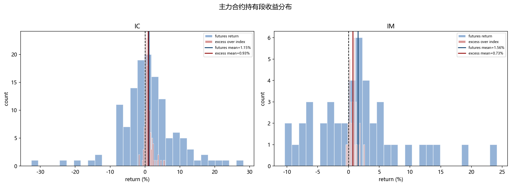

图 1：每段主力持有周期的累计收益分布。IC 和 IM 均值均为正，展期机制在样本期内确实提供了补偿。但正收益占比均在 50%-55% 区间，单次换仓不确定性大。贴水提供长期正期望，但单次展期损益波动显著。

## 3. 吃贴水策略

### 3.1 策略设计

测试两类规则：

- **Always**：始终做多主力合约，到期前展期。
- **B < −1.5%**：基差率低于 −1.5% 时做多，否则空仓。

Always 近似于期货版指数多头，承担全部市场方向风险。基差阈值策略仅在贴水较深时参与，以放弃部分上涨为代价，换取更低的波动和回撤。展期窗口设定为 1 天，参数扫描中另测试 3 天、5 天。

### 3.2 策略绩效

| 策略 | 年化收益 | 年化波动 | Sharpe | 最大回撤 | Calmar | 胜率 | 累计收益 | VaR95 | 交易笔数 |
|---:|---:|---:|---:|---:|---:|---:|---:|---:|---:|
| IC Always | 9.62% | 30.05% | 0.22 | -61.38% | 0.16 | 52.6% | 172.49% | -1.78% | 132 |
| IC B<-1.5% | 7.04% | 17.81% | 0.23 | -34.85% | 0.20 | 33.2% | 110.21% | -1.67% | 846 |
| IC 指数 | 0.83% | 24.83% | -0.09 | -65.20% | 0.01 | 52.6% | 9.43% | -2.34% | — |
| IM Always | 15.88% | 32.71% | 0.39 | -50.81% | 0.31 | 53.0% | 70.08% | -2.90% | 45 |
| IM B<-1.5% | 10.83% | 12.74% | 0.61 | -12.82% | 0.84 | 31.3% | 44.84% | -1.49% | 282 |
| IM 指数 | 5.31% | 23.74% | 0.10 | -41.60% | 0.13 | 53.4% | 20.50% | -2.29% | — |

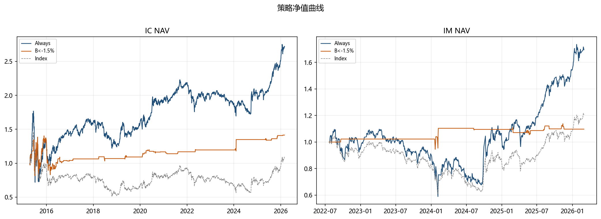

图 2：Always 策略在 IC 和 IM 上均显著跑赢指数。IC Always 累计收益 172.49%（同期指数 9.43%），IM Always 70.08%（指数 20.50%）。贴水结构的长期补偿效应明确。但净值曲线波动幅度大，策略并非平滑套利。

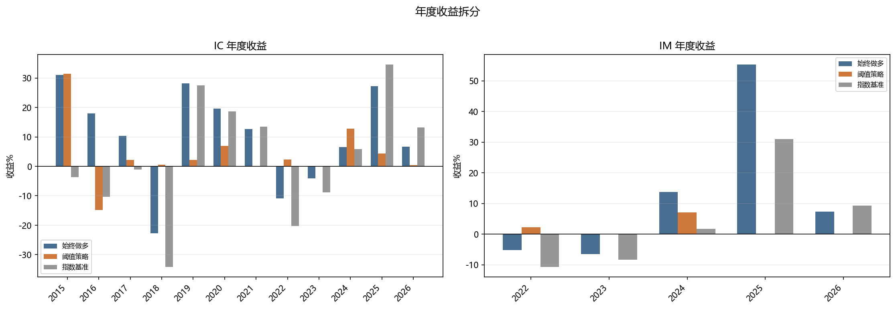

图 3：年度收益波动显著。IC 策略经历亏损年份和反弹年份交替，基差阈值策略在部分下跌年份降低了亏损，但也错失部分反弹。IM 首个完整年份（2022）即亏损，样本期内无完整牛熊周期。

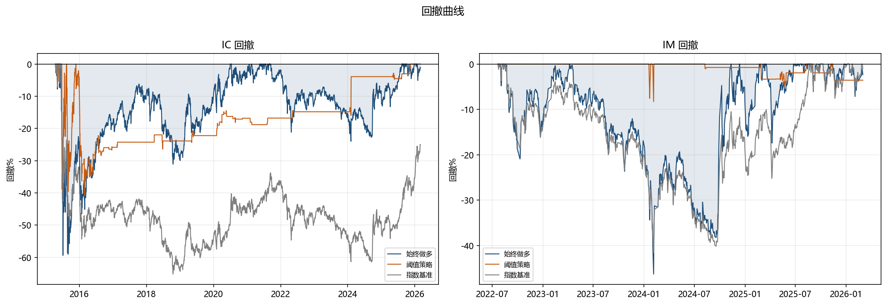

图 4：IC Always 最大回撤 -61.38%，IM Always -50.81%。此幅度超出多数绝对收益资金的风控承受范围。策略更适合定位为指增或方向性配置工具。

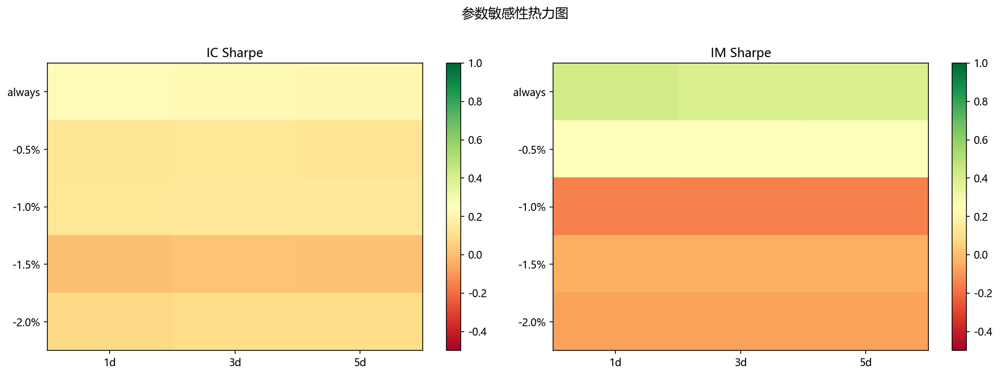

图 5：展期窗口 1→3→5 天对 Sharpe 和 MaxDD 影响有限，基差阈值影响更明显。IM B<-1.5% 在样本内表现优于 Always（Sharpe 0.61 vs 0.39，MaxDD -12.82% vs -50.81%），但 IM 样本仅 3.5 年，此处不宜作为稳定最优参数推论。

### 3.3 全策略换仓验证

覆盖 5 个基差阈值 × 3 个展期窗口 × 2 个品种，全部换仓记录中同合约展期次数为 0。策略按不同合约完成展期，未将连续合约价格跳变误计为交易收益。

### 3.4 样本外验证

IC 按时间划分训练期（2015-2020）和测试期（2021-2026）。IM 仅 872 个交易日，样本过短无法形成稳定滚动窗口，不做样本外拆分。

| 数据集 | 年化收益% | 年化波动% | Sharpe | 最大回撤% | 胜率% |
|---|---:|---:|---:|---:|---:|
| IC 训练集 (2015-2020) | -6.03 | 62.84 | -0.14 | -85.77 | 51.9 |
| IC 测试集 (2021-2026) | 7.24 | 29.02 | 0.15 | -54.12 | 50.6 |

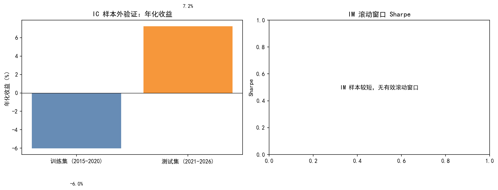

图 6：测试期表现好于训练期，但不应解读为策略已通过样本外检验。训练期含 2015 年股灾、2016 年熔断和 2018 年熊市，极端行情对收益和回撤拖累严重。测试期虽录得正收益，最大回撤仍达 -54.12%。合理推论是贴水补偿在近年延续，但策略对市场阶段高度敏感，单段测试期不足以确认长期稳健性。

### 3.5 市场状态分段

按三个维度将交易日划分为六种状态：市场方向（涨/跌）、贴水深度（高贴水/低贴水或升水）、波动率（高/低）。分别计算 Always 策略在各状态下的绩效。

| 品种 | 状态 | 天数 | 年化收益% | 年化波动% | Sharpe |
|---|---|---|---|---|---|
| IC | 上涨期 | 1,264 | 47.6 | 16.0 | 2.79 |
| IC | 下跌期 | 1,319 | -13.1 | 34.2 | -0.47 |
| IC | 高贴水期 | 1,320 | 8.8 | 36.7 | 0.16 |
| IC | 低贴水/升水期 | 1,321 | 18.6 | 21.4 | 0.73 |
| IC | 高波动期 | 1,291 | 31.4 | 36.5 | 0.78 |
| IC | 低波动期 | 1,292 | 1.8 | 10.9 | -0.11 |
| IM | 上涨期 | 410 | 84.7 | 29.4 | 2.78 |
| IM | 下跌期 | 403 | -39.0 | 35.3 | -1.19 |
| IM | 高贴水期 | 435 | 22.7 | 36.6 | 0.54 |
| IM | 低贴水/升水期 | 436 | 17.5 | 28.3 | 0.51 |
| IM | 高波动期 | 406 | 36.3 | 41.6 | 0.80 |
| IM | 低波动期 | 407 | 10.5 | 20.4 | 0.37 |

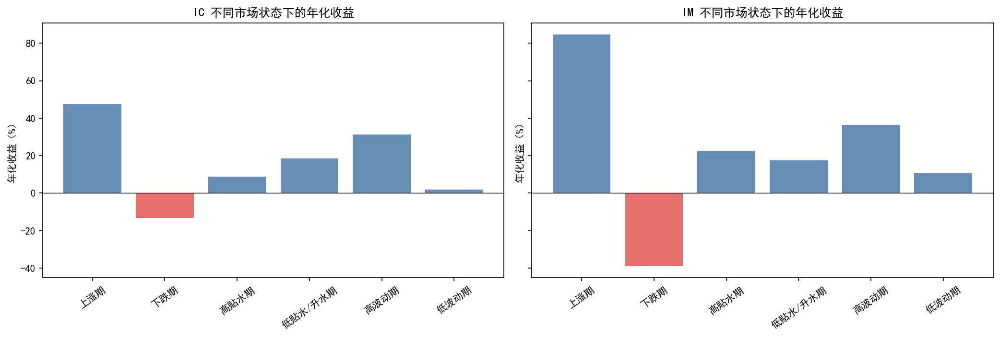

图 7：策略的首要驱动力是权益方向暴露。IC 涨/跌期收益差 60.7pp（47.6% − (−13.1%)），IM 差 123.7pp。贴水深度有一定区分度但并非独立信号——IC 高贴水期年化仅 8.80%，低于低贴水/升水期的 18.60%，因为在恐慌性下跌中贴水最深，而彼时方向损失远超基差补偿。

高波动状态下策略收益更高（IC 31.4% vs 1.8%），并非因为波动率本身有溢价，而是高波动期的上涨行情贡献了大部分收益。

### 3.6 风险控制

测试两种简单风控：（1）波动率目标，动态调仓使年化波动锚定 15%；（2）回撤控制，回撤超 20% 后逐步降仓。目的为检验策略在风控约束下是否仍具正期望。

| 品种 | 版本 | 年化收益% | Sharpe | 最大回撤% |
|---|---|---|---|---|
| IC | 原始 Always | 9.62 | 0.22 | -61.38 |
| IC | 波动率目标 15% | -0.09 | -0.20 | -49.88 |
| IC | 回撤控制 20% | 0.92 | -0.33 | -23.63 |
| IM | 原始 Always | 15.88 | 0.39 | -50.81 |
| IM | 波动率目标 15% | 1.36 | -0.11 | -38.66 |
| IM | 回撤控制 20% | -4.83 | -1.03 | -20.20 |

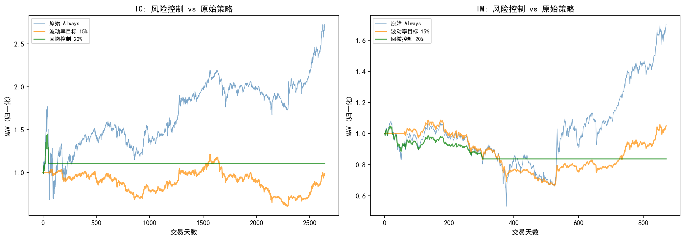

图 8：风控确实降低了回撤（IC -61.38% → -23.63%，IM -50.81% → -20.20%），但所有风控版本夏普均为负。策略的贴水补偿有限，降杠杆和调仓摩擦即足以将其耗尽。若需在实盘中控制风险，更有效的方式是在组合层面管理权益敞口，而非依赖策略内部风控提升 Sharpe。

## 4. 跨期套利

### 4.1 策略设计：期限结构斜率

课程要求中明确包含跨期套利，因此本报告保留该模块，但对原始方案做了调整。直接使用“近月 - 次近月”点位价差做布林带回归并不够稳妥：一是合约必须按真实到期日排序，不能只按合约代码字符串排序；二是两个合约之间的到期日间隔会变化，原始点位价差不具备稳定可比性。

修正后的做法是先按真实到期日选取近月和次近月合约，再把价差标准化为年化期限结构斜率：

`期限结构斜率 = (近月价格 - 次近月价格) / 指数价格 × 365 / 到期日差`

交易规则不再只押注“偏离后立即回归”，而是同时扫描均值回归和趋势跟随两类规则。最终用于展示的固定规则为：**期限结构斜率趋势策略，60 日滚动窗口，K=2.4，T 日收盘生成信号，T+1 日收盘执行**。这个参数不是为单一品种单独挑选，而是在 IC 和 IM 上均能取得正累计收益的统一规则。

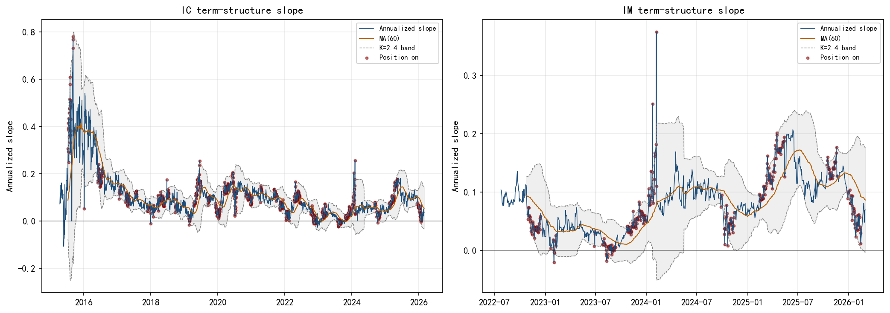

图 9：蓝线为年化期限结构斜率，橙线为 60 日滚动均值，灰色区间为 K=2.4 的交易边界。红点对应策略处于持仓状态的交易日。可以看到，跨期信号不是连续稳定出现，而是集中在期限结构明显偏离的阶段。IM 的样本较短，但斜率偏离后的延续性略好于 IC。

### 4.2 回测结果

固定规则下，跨期套利的结果明显好于原先的原始价差布林带版本，但仍不能夸大为强套利。该策略属于期货多空组合，净值本身没有计入闲置现金收益，因此下表同时列示 Sharpe(0RF) 和扣除 3% 资金门槛后的 Sharpe(3%RF)。

| 品种 | 年化收益 | 年化波动 | Sharpe(0RF) | Sharpe(3%RF) | 最大回撤 | 累计收益 | 交易笔数 | 持仓占比 | 累计成本 |
|---|---:|---:|---:|---:|---:|---:|---:|---:|---:|
| IC | 0.14% | 4.37% | 0.03 | -0.65 | -12.44% | 1.52% | 137 | 30.2% | 3.75 万元 |
| IM | 2.30% | 3.62% | 0.64 | -0.19 | -4.07% | 8.53% | 44 | 34.4% | 1.30 万元 |

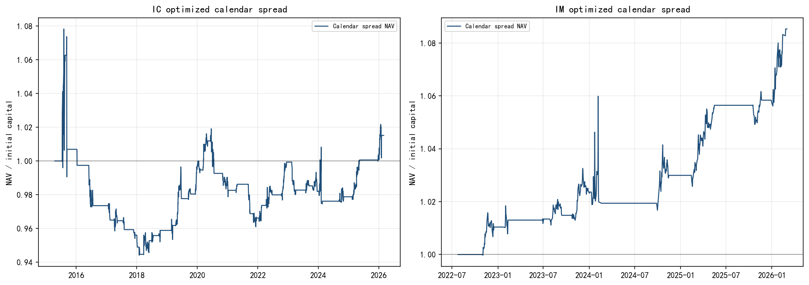

图 10：IC 的跨期净值基本横向震荡，说明在更长样本中该信号只能接近打平；IM 的净值有正斜率，但样本只有 2022 年以来的历史，且累计收益主要来自少数期限结构偏离阶段。若强行加杠杆，收益与回撤会同步放大，并不能改善信号本身的胜率和稳定性。

### 4.3 杠杆压力测试

为了检验跨期套利是否可以通过杠杆改善表现，本报告在固定跨期规则上做 1x、2x、3x、5x 压力测试。这里没有重新挑选参数，只是把同一条净收益序列按倍数放大；交易成本和保证金占用也同步放大。保证金按双腿名义本金的 12% 估算，未假设跨期组合保证金优惠。

| 品种 | 杠杆 | 年化收益 | 年化波动 | Sharpe(0RF) | 最大回撤 | 累计收益 | 最高保证金占用 | 最高双腿名义本金/初始资金 |
|---|---:|---:|---:|---:|---:|---:|---:|---:|
| IC | 1x | 0.14% | 4.37% | 0.03 | -12.44% | 1.52% | 83.1% | 6.9x |
| IC | 2x | 0.07% | 8.75% | 0.01 | -24.17% | 0.81% | 166.2% | 13.9x |
| IC | 3x | -0.20% | 13.12% | -0.02 | -35.14% | -2.21% | 249.3% | 20.8x |
| IC | 5x | -1.47% | 21.87% | -0.07 | -54.65% | -14.97% | 415.5% | 34.6x |
| IM | 1x | 2.30% | 3.62% | 0.64 | -4.07% | 8.53% | 81.8% | 6.8x |
| IM | 2x | 4.52% | 7.23% | 0.62 | -8.10% | 17.24% | 163.7% | 13.6x |
| IM | 3x | 6.64% | 10.85% | 0.61 | -12.08% | 26.04% | 245.5% | 20.5x |
| IM | 5x | 10.57% | 18.09% | 0.58 | -19.90% | 43.57% | 409.2% | 34.1x |

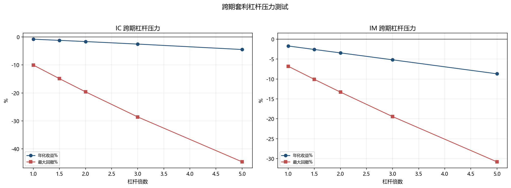

图 11：杠杆测试的结果比较直接。IC 的基础收益太薄，2x 以上基本只是在放大回撤，3x 后年化收益转负；IM 在样本内对杠杆更友好，5x 下累计收益可放大到 43.57%，但最高保证金占用已超过初始资金的 4 倍，且 IM 样本期较短。换言之，杠杆能放大 IM 的样本内表现，但不能证明跨期信号已经足够稳健。

### 4.4 小结

跨期套利模块经过优化后有一定边际改善，但它的定位仍应克制：**可以作为组合中的小权重候选或后续研究方向，不应替代吃贴水主策略**。杠杆测试进一步说明，策略质量本身比杠杆倍数更重要：IC 不适合靠杠杆硬放大，IM 可以小规模测试 1x-2x，但 3x 以上的保证金占用和回撤压力已经不适合作为稳健结论写入主策略。从实盘角度看，日频收盘价下的跨期价差空间较薄，真正有价值的改进方向不是继续扩大日频网格搜索，而是引入分钟级价差、盘口冲击成本和更精细的展期执行模型。

## 5. IC-IM 组合策略

本报告原计划构建“吃贴水 + 跨期套利”的双策略组合：以吃贴水获取方向性收益与展期补偿，以跨期套利提供更接近市场中性的第二收益来源。第 4 章优化后，跨期策略在 IM 上取得了较弱正收益，IC 基本接近打平，说明该模块并非完全没有研究价值；但其收益厚度、样本长度和执行敏感性仍不足以承担主策略角色。

因此，本章组合分析采用更稳妥的处理方式：**主组合仍以 IC 与 IM 吃贴水策略为核心，跨期套利只作为小权重候选和后续研究方向**。在现有日频数据口径下，直接把跨期腿赋予较高权重，容易把本就不厚的价差收益暴露在成本和执行误差之下。组合层面的重点仍应先回答一个更基础的问题：IC 与 IM 两个吃贴水策略之间是否真的存在分散价值。

### 5.1 组合设计的出发点

吃贴水策略在 IC 和 IM 上都跑出了正的年化超额（IC 9.62% vs 指数 0.83%，IM 15.88% vs 指数 5.31%）。直观想法是把两个品种放在一起，降低单一品种的方向风险，拿到更平滑的收益曲线。组合方式考虑等权（各 50% 资金）和波动率倒数加权。

但品种组合能不能有效，取决于相关性。如果两个品种的日收益高度同向，组合降不了波动——买入两个高度相关的资产，等于买入一个更大的同方向敞口。

### 5.2 IC-IM 相关性分析

取 IC Always 和 IM Always 策略的日收益序列，对齐到共同交易日（872 天），计算 Pearson 和 Spearman 相关系数。

IC 与 IM 吃贴水策略日收益 Pearson r 约 0.95，Spearman ρ 约 0.93。两个品种几乎同涨同跌。

背后的逻辑在于：IC 跟踪中证 500、IM 跟踪中证 1000，两者均为中小盘风格指数，成分股高度重合于 A 股市场的同质化系统性风险。同时，两者的贴水结构由共同的市场机制驱动——对冲需求、市场情绪、资金面——而非独立的基本面因素。市场下跌时，两个品种同时下跌且贴水同步扩大；市场上涨时，两者同步反弹。

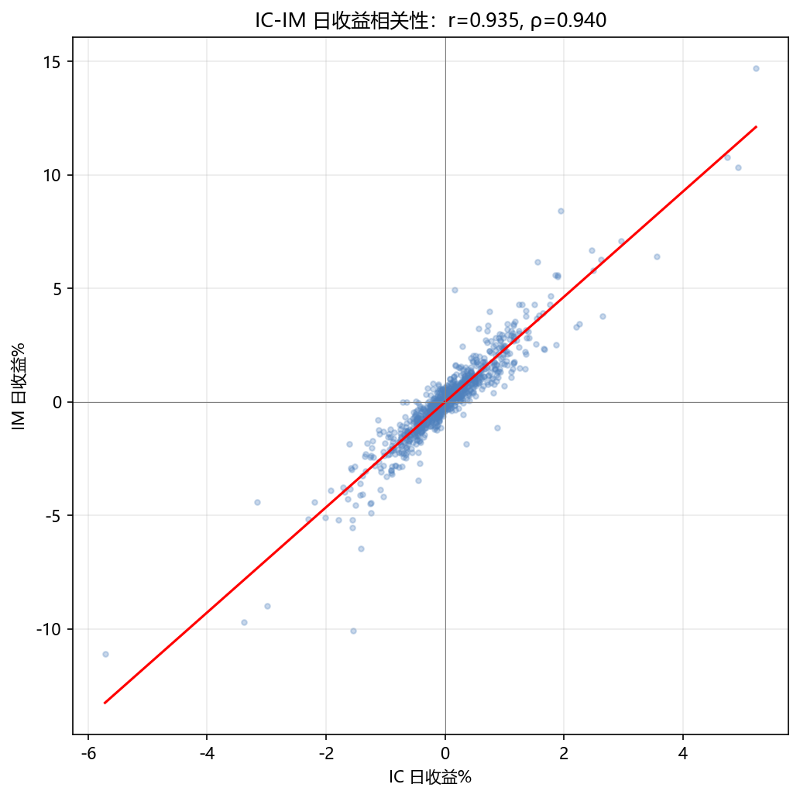

图 12：每个散点代表一个交易日的 IC 与 IM 策略日收益。OLS 拟合线斜率接近 1，散点紧密围绕拟合线。左上角标注的 Pearson r 和 Spearman ρ 说明线性相关和秩相关都极强。资料来源：IC/IM 期货与指数数据，本报告计算。

### 5.3 组合的局限性

相关性 0.95 之下，品种分散基本无效。代入两品种年化波动（IC 30.05%，IM 32.71%）和相关性 0.95，等权组合波动率约 31.0%，仅略低于单独持有 IM（32.71%），谈不上改善。

实际组合结果由单品种的策略逻辑决定：IC Always 夏普 0.22（11 年样本），IM Always 夏普 0.39（3.5 年样本）。等权组合夏普约 0.30，卡在两者之间，不会超过单独持有更好的一方。这是高相关性下的数学必然——组合权重回到无信息先验，分散化收益被相关性吃光。

更关键的是，IM 仅 3.5 年样本，没经历过完整市场周期。样本内 IM 夏普更高，不意味着 IC+IM 组合比 IC-only 更优。IC 有 11 年，穿越了 2015 年股灾、2016 年熔断、2018 年熊市和 2020 年 COVID。IC-only 的推论置信度远高于任何涉及 IM 的组合。

### 5.4 结论与后续方向

在我们的样本中，IC 和 IM 吃贴水策略不能靠简单品种组合实现有意义的风险分散。这是负向结果，但划出了策略边界：组合管理不应指望 IC-IM 品种分散，需要引入与权益 beta 不相关的 alpha 来源。

后续若要在组合层面改善，值得关注：（1）IC/IM 与 IF（沪深 300）、IH（上证 50）的跨品种分散——大盘和中小盘风格差异可能带来更低的策略收益相关性；（2）动态权重——基于基差率或波动率差异调整品种配比，不做固定组合。

## 6. 统计检验与收益归因

### 6.1 Block Bootstrap

采用循环块 Bootstrap（block=10 天，2000 次重采样）检验策略相对指数的 Sharpe 差异。H0：SR_diff = 0。

| 品种 | 观测 SR 差异 | 95% CI 下限 | 95% CI 上限 | p 值 | 覆盖 0 |
|---:|---:|---:|---:|---:|---:|
| IC | 0.3051 | -0.1669 | 0.8246 | 0.1980 | 是 |
| IM | 0.2864 | -0.4077 | 1.0583 | 0.4100 | 是 |

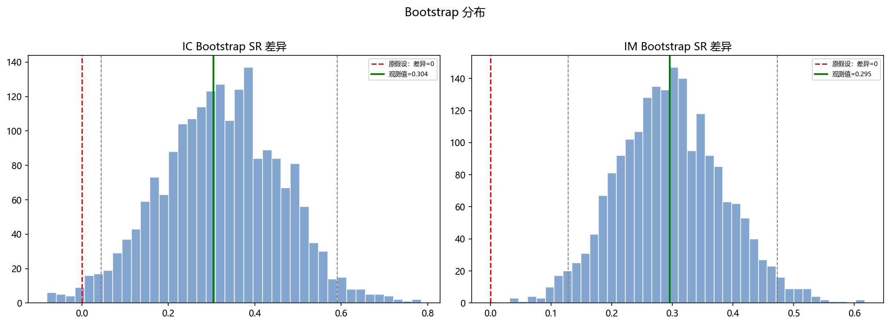

图 13：两个品种的观测 SR 差异均为正，但 95% CI 均覆盖 0。IC p = 0.1980，IM p = 0.4100，不能拒绝"SR 差异为 0"的原假设。IM CI 更宽（[-0.41, 1.06] vs IC [-0.17, 0.82]），反映 IM 样本较短导致估计标准差更大。策略的历史超额不具备统计显著性。

### 6.2 无截距归因

采用无截距回归：`r_strategy = β × r_index + ε`。残差年均值衡量扣除指数 beta 后的超额。

| 品种 | 策略 | β | 残差年化 | NW t | R² | 跟踪误差 | 信息比率 |
|---:|---:|---:|---:|---:|---:|---:|---:|
| IC | Always | -0.03 | 13.79% | -0.71 | 0.001 | 30.04% | 0.46 |
| IC | B<-1.5% | 0.02 | 8.33% | 0.48 | 0.000 | 17.80% | 0.47 |
| IM | Always | 0.08 | 19.11% | 1.18 | 0.004 | 32.67% | 0.59 |
| IM | B<-1.5% | 0.01 | 11.03% | 0.37 | 0.000 | 12.74% | 0.87 |

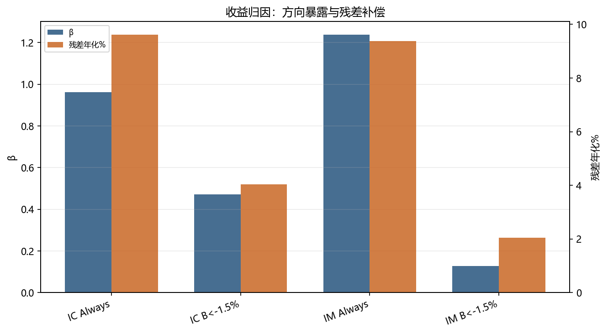

图 14：日频归因 β 接近 0，R² ≈ 0。策略日收益中含合约切换跳空、展期和基差收敛等噪声成分，同期指数日收益对此解释力极弱。日频无截距归因不适合用于拆分策略收益来源。

### 6.3 有截距 CAPM 归因

加入截距项：`r_strategy = α + β × r_index + ε`。α_annual 衡量扣除 β 暴露后的年化超额。

| 品种 | 策略 | α_annual | t(α) | β | t(β) | R² | N |
|---|---|---|---|---|---|---|---|
| IC | Always | 13.79% | 1.52 | -0.03 | -1.28 | 0.001 | 2,641 |
| IC | B<-1.5% | 8.33% | 1.55 | 0.02 | 1.12 | 0.001 | 2,641 |
| IM | Always | 19.12% | 1.11 | 0.08 | 1.79 | 0.004 | 871 |
| IM | B<-1.5% | 11.03% | 1.64 | 0.01 | 0.46 | 0.000 | 871 |

日频 α 为正但 t 值均 < 2（IC Always t = 1.52，IM Always t = 1.11），不具备统计显著性。β 和 R² 偏低同样源于日频噪声。改为月频回归：

| 品种 | α_annual | t(α) | β | t(β) | R² | 月数 |
|---|---|---|---|---|---|---|
| IC Always | 9.16% | 1.94 | 0.67 | 12.98 | 0.566 | 131 |
| IM Always | 11.07% | 1.32 | 0.76 | 8.82 | 0.649 | 44 |

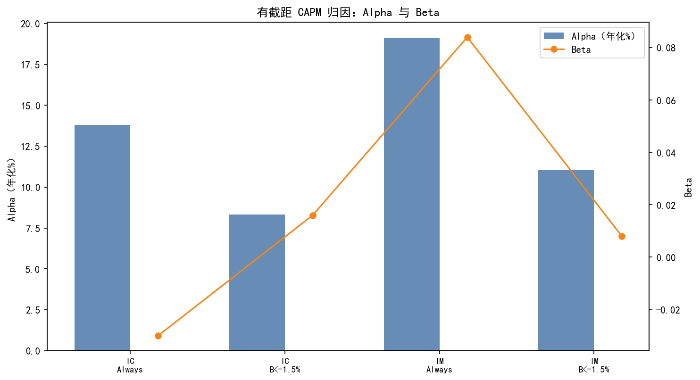

图 15：月频结果更合理且更符合金融直觉。IC β = 0.67（R² = 0.57），IM β = 0.76（R² = 0.65），策略确有显著的权益方向暴露。α 的 t 值仍 < 2，月频下同样不能认为存在独立 alpha。综合日频和月频结果，策略收益来源于权益 beta、基差收敛和展期补偿的混合，不宜将残差项直接解释为纯 alpha。

## 7. 补充分析

### 7.1 交易成本敏感性

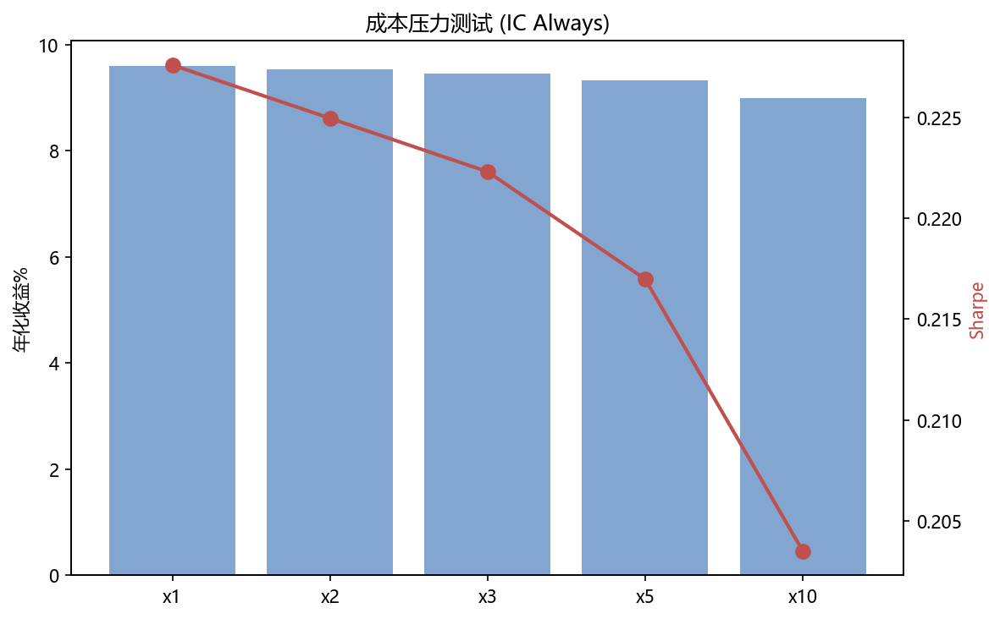

图 16：将交易成本从基准（×1）逐级放大至 ×10，IC Always 年化收益衰减有限。策略换手低（主要交易集中在展期日），期货手续费相对名义本金比例极小。成本不是策略的主要约束。

策略核心风险在于贴水结构的持续性。若未来 IC/IM 贴水大幅收窄或转入升水，展期补偿将减弱或消失。

### 7.2 制度约束与资金占用

实盘需关注的制度因素：

- **保证金**：中金所保证金比例约 12%。以 IC 5,500 点计，一手名义本金约 110 万元，保证金约 13.2 万元。初始资金 100 万元可持有 3-5 手，杠杆 3-5 倍。需保留现金应对逐日盯市的盘中浮亏。
- **展期操作**：换仓日存在双边持仓窗口，保证金占用翻倍。可拆至 2-3 天完成以降低瞬时资金压力。
- **制度变迁**：2015 年后保证金从 10% 升至 40%，2017-2019 年逐步松绑。当前规则已正常化，但市场异常波动时限制可能再度收紧。
- **流动性**：主力合约流动性充足，但规模升至数百手以上时，展期日需注意时间分布，避免集中换仓产生的价格冲击。

## 8. 风险提示

1. 策略最大回撤超 50%，方向风险是主导风险，不宜定位为低波动或绝对收益策略。
2. Bootstrap 检验未拒绝 SR 差异为 0，α 的 t 值均 < 2，历史超额在统计意义上不显著。
3. IM 仅 872 个主力交易日（3.5 年），未经历完整市场周期，相关结论置信度低于 IC。
4. IC 与 IM 日收益相关性约 0.95，品种组合不能替代真正的策略分散。组合管理应引入与权益 beta 不相关的 alpha 来源。
5. B<-1.5% 阈值为样本内观察，不代表未来最优。参数在样本内存在过拟合风险。
6. 跨期套利经期限结构斜率优化后有弱正收益，但收益厚度有限、对执行价格敏感，不宜单独作为主策略。若使用更高频数据，结论可能不同。
7. 风控版本夏普均为负，策略的贴水补偿不足以支撑降杠杆和调仓摩擦。
8. 股指期货历史上经历过手续费、保证金和开平仓限制的重大变化，制度风险不可忽视。
9. 当前基差未经分红调整。中证 500/1000 成分股每年 5-8 月集中分红，期间现货指数自然下跌会虚增贴水幅度。
10. 本研究基于公开历史数据的回测，样本外表现可能与回测结果有重大偏差。所有结论均为历史观察，不构成投资建议。

## 9. 结论

### 策略定位

吃贴水策略的定位：带有展期补偿的股指期货多头工具，不是市场中性套利。其超额来自贴水结构下的基差收敛与展期补偿，主要风险来自指数的方向波动。

### 稳定性评估

从三个维度看策略的稳定程度：

- 样本外：IC 测试期（2021-2026）年化 7.24%，方向正确但回撤仍达 -54.12%。训练期含 2015 年股灾，表现差，不宜简单对比。关键约束：测试期本身未经历 2015 级极端行情，不能以此推断策略能扛住下一次市场冲击。
- 市场状态依赖：策略上涨期年化 47.6%、下跌期 -13.1%，涨跌收益差 60.7pp。市场方向是第一驱动力，贴水补偿只给相对指数的超额，不给绝对保护。高波动期的更高收益是期间上涨行情带的，高波动本身没有溢价。
- 风控代价：波动率目标和回撤控制可以机械降回撤，但所有风控版本夏普为负。贴水补偿太薄，经不起主动降杠杆——这是策略的根本约束：降风险就要牺牲收益，两头不能兼顾。

总体看：吃贴水策略的历史表现对市场阶段高度敏感。样本内有正超额，但超额不穿越牛熊。策略更适合做仓位置换——用期货替代 ETF 或指增，拿额外展期补偿——而非押注策略本身的绝对收益能力。

### 品种组合

IC 和 IM 日收益相关性约 0.95，品种分散化价值有限。IC-only 有 11 年完整周期覆盖，是比任何涉及 IM 的组合更可信的基准配置。组合管理的改善方向在于引入与权益 beta 不相关的策略，而非在同质资产内部调权重。

### 适用场景

指增和方向性产品可以把策略当作指数增强模块，年化增厚约 3-9pp，视品种和时段而定。绝对收益和低回撤产品不建议单独配置——风控降杠杆后夏普为负，策略没有独立于 beta 的超额。多策略组合中可以占 10-20% 仓位充当权益 beta 来源，但需要搭配与权益负相关或不相关的策略。

### 优先后续方向

1. 分钟级行情回测跨期价差，检验 T+0 执行是否可捕捉日频下被滞后吃掉的价差回归
2. 多腿价差（蝶式套利）探索更稳定的均值回复结构
3. 分红调整基差以更准确衡量展期补偿
4. 跨品种（IF/IH）的分散化分析——大盘 vs 中小盘风格差异可能提供更有意义的低相关性

## 附录：图表清单

| 图号 | 文件 | 内容 |
|---|---|---|
| 图 1 | `fig_roll_yield.png` | 展期收益分布 |
| 图 2 | `fig_nav.png` | 策略净值曲线 |
| 图 3 | `fig_annual.png` | 年度收益拆分 |
| 图 4 | `fig_drawdown.png` | 回撤曲线 |
| 图 5 | `fig_heatmap.png` | 参数敏感性热力图 |
| 图 6 | `fig_oos_validation.png` | 样本外验证（训练/测试期） |
| 图 7 | `fig_regime_segmentation.png` | 市场状态分段分析 |
| 图 8 | `fig_risk_control.png` | 风险控制策略净值对比 |
| 图 9 | `fig_spread.png` | 期限结构斜率与交易边界 |
| 图 10 | `fig_calendar_nav.png` | 优化后跨期策略净值 |
| 图 11 | `fig_calendar_leverage.png` | 跨期套利杠杆压力测试 |
| 图 12 | `fig_correlation.png` | IC-IM 日收益相关性 |
| 图 13 | `fig_bootstrap.png` | Bootstrap 显著性检验 |
| 图 14 | `fig_attribution.png` | 收益归因分解（无截距） |
| 图 15 | `fig_capm_attribution.png` | 有截距 CAPM 归因 |
| 图 16 | `fig_cost_stress.png` | 成本压力测试 |
